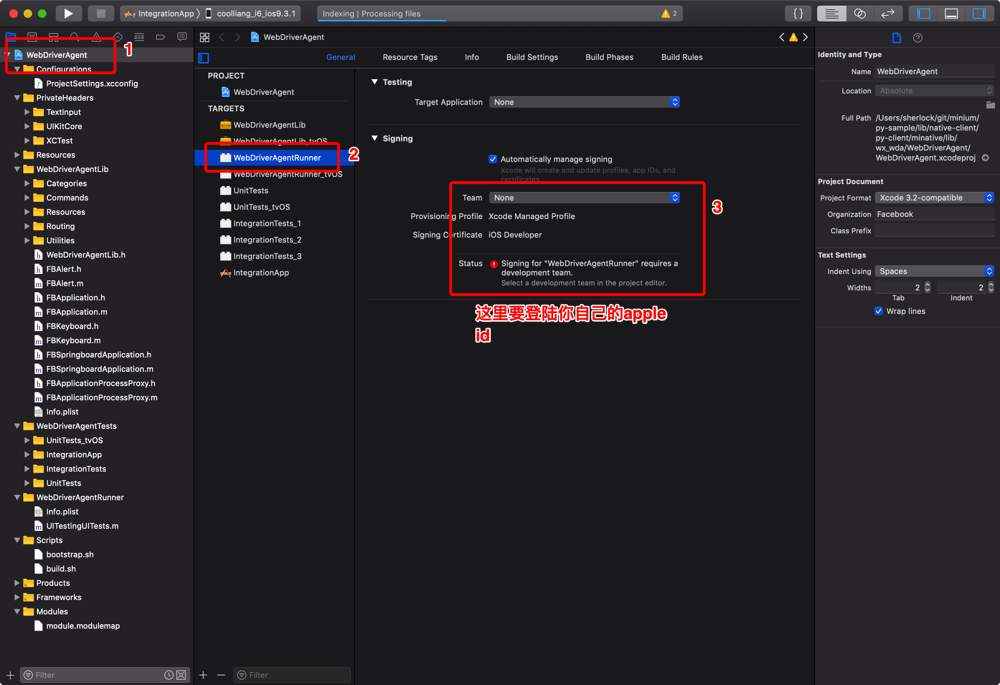
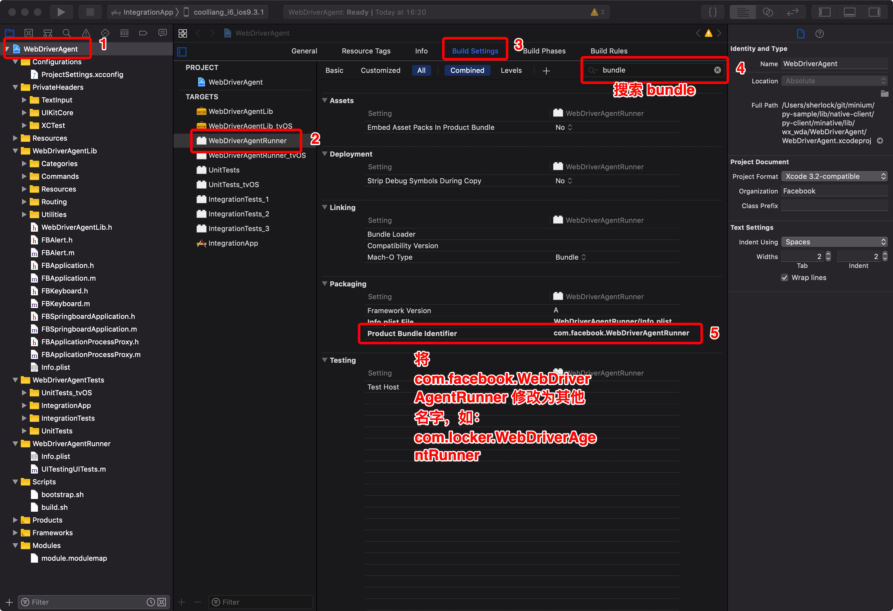
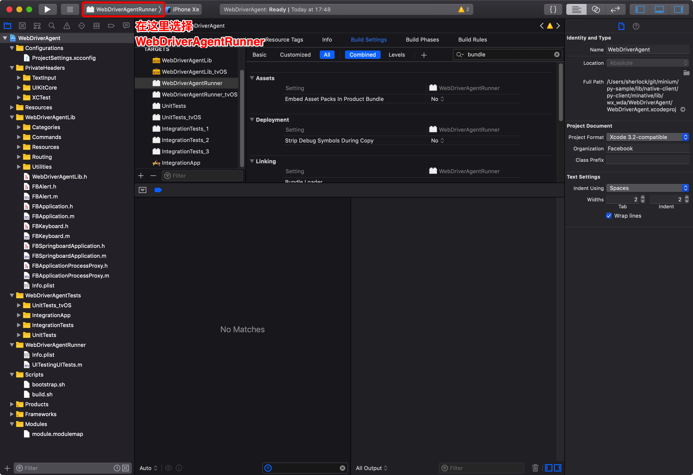
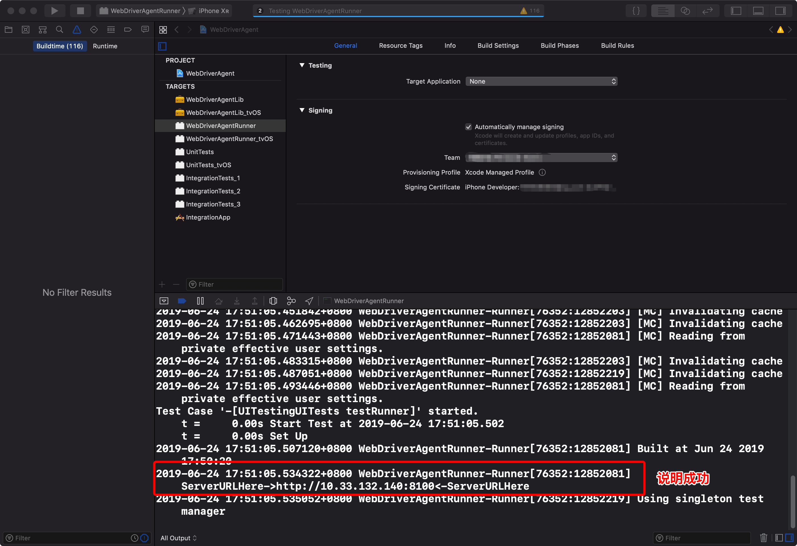

# 真机测试

minium通过配置文件来识别小程序运行的平台，如果需要测试手机上的小程序，那么需要把配置项`platform`改成Android或者IOS

## Android

Android需要保证命令行能识别到手机设备
```
$ adb devices
List of devices attached
28fb61d0ef1c7ece	device
```
如果只有一台手机在线，那么只需要把`platform`配置成`Android`即可， 而如果多台设备连接到手机，配置文件需要制定设备的序列号，如:

```
{
  "debug_mode": "debug",
  "enable_app_log": false,
  "platform": "Android",
  "device_desire": {
    "serial": "28fb61d0ef1c7ece"
  }
}
```

## IOS

### 配置 WebDriverAgent

minium 自带的 wda 工程位于`minative/lib/wx_wda/WebDriverAgent`下面，只需要简单配置两个选项即可





配置完成之后，可以用`⌘+u`快捷键运行 unit test 测试 wda 是否正常运行



### 配置测试 config.json

在用例目录下面新增一个叫`config.json`的配置文件，格式如下

```json
{
  "platform": "iOS",
  "device_desire":{
    "wda_project_path": "/Users/sherlock/github/appium/WebDriverAgent", //自定义 wda 的路径
    "device_info": {
          "udid": "aee531018e668ff1aadee0889f5ebe21a2292...", //手机的 uuid 
          "model": "iPhone XR",
          "version": "12.2.5",
          "name": "sherlock's iPhone"
    }
  }
}
```