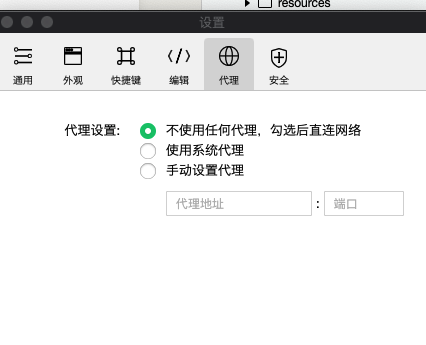
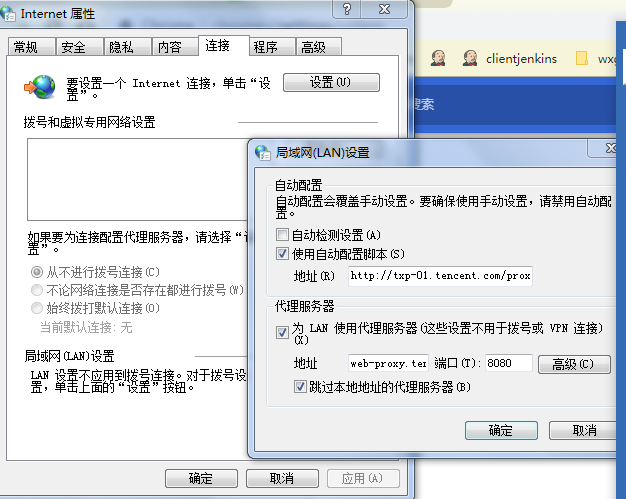
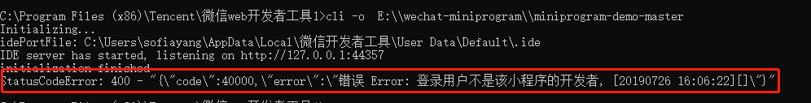
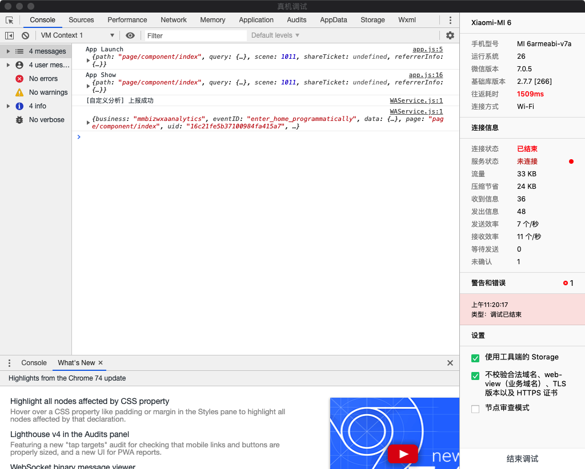
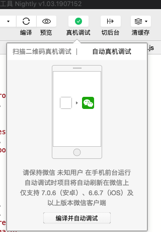

# FAQ

## 通用问题
> 如何反馈问题或提供建议?

内部开发者和测试人员可以直接到项目所在 Git 提 [issue](https://git.code.oa.com/wxg-td/minium/), 感谢你的反馈和宝贵的建议。

## 接口用法问题

> native接口问题

目前native接口对于ide不适用，在ide上调用将会什么都不做。

> 开发者工具底部显示的路径问题

    page/component/pages/view/view

这里显示的是绝对路径，使用的时候需要在最前面加上“/”

    /page/component/pages/view/view

## 环境安装问题

> module 'websocket' has no attribute 'WebSocketApp'

`pip3 list` 查看是否安装了 `websocket`，如果有执行 `pip3 uninstall websocket` 卸载 `websocket` 即可。

> Windows 路径问题

如果我们直接从windows的文件浏览器中粘贴路径名到配置文件，会出现json文件格式错误，可以把'\\'替换成'\\\\'。

> 代理问题

如果启动 IDE 或者运行脚本的时候发现出现连接超时等错误，Windows请确认下面两个设置是否如下图所示：

如无法解决，请联系`@lockerzhang`、`@xiazeng` 或者`@yopofeng` 帮忙协助解决，这大多数情况是因为公司的网络策略出现的问题，具体问题具体分析。

> 项目无法打开

如果命令行启动开发者工具的时候无法打开项目，请确认以下事项：

1. 检查你是否有该小程序的开发者权限：
    

2. 开发者工具版本是否最新，在这里下载最新的开发者工具：
    [https://developers.weixin.qq.com/miniprogram/dev/devtools/nightly.html](https://developers.weixin.qq.com/miniprogram/dev/devtools/nightly.html)
    

## 真机调试问题

> iOS真机问题

iOS：iOS 真机下面运行出现问题，大多数情况是 WDA 运行的问题，可以参考本文的 WDA 设置指引：[真机测试](minium/Python/framework/mobile?id=ios)。

> Android真机问题

操作Native组件需要安装apk，但是有部分手机的弹框不能处理掉，第一次安装失败可以手动安装。apk包含在安装包中，可以输入`miniruntest --apk`

> 连接超时问题

控制台出现`Exception: receive from remote timeout, id: f933c71e-bc2b-41b7-b286-29c65dd0d4d8`报错时，一般是因为ide的通道被远程调试占用了，请检查ide是否有打开

1. 调试窗口（包括上一次打开未关闭的）

    

2. 正在显示真机调试的二维码或者自动真机调试

    

3. 开发者工具的公共库版本过低，请确保选择了最新的公共库，`2.7.3`以上

    如果有上述界面，请关闭再重试