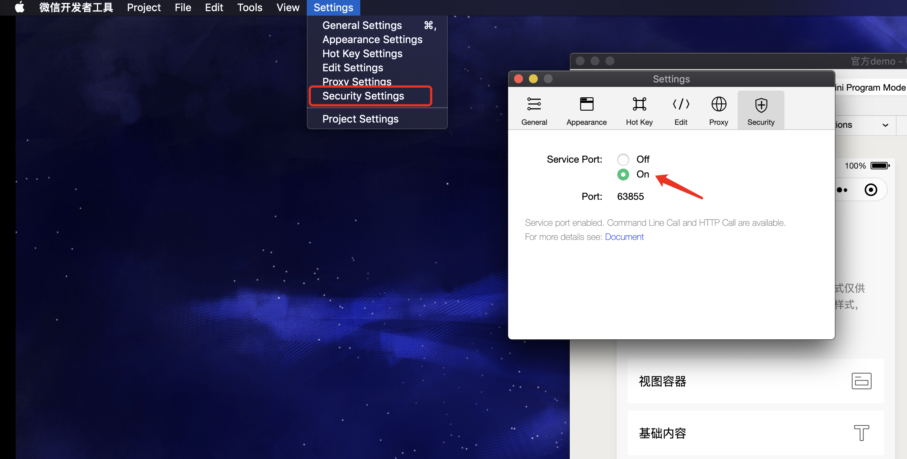
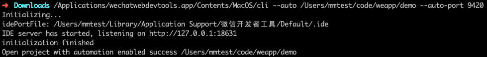
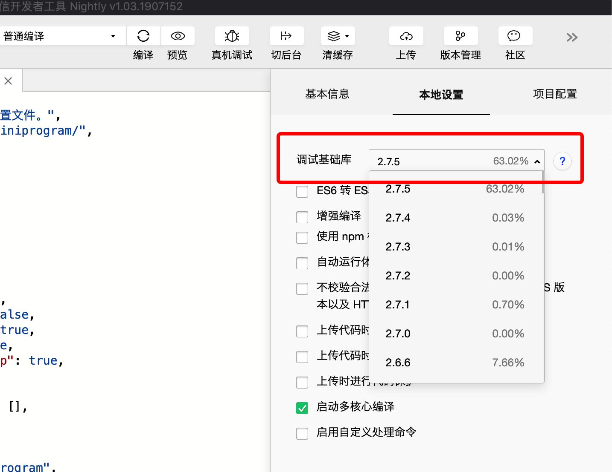
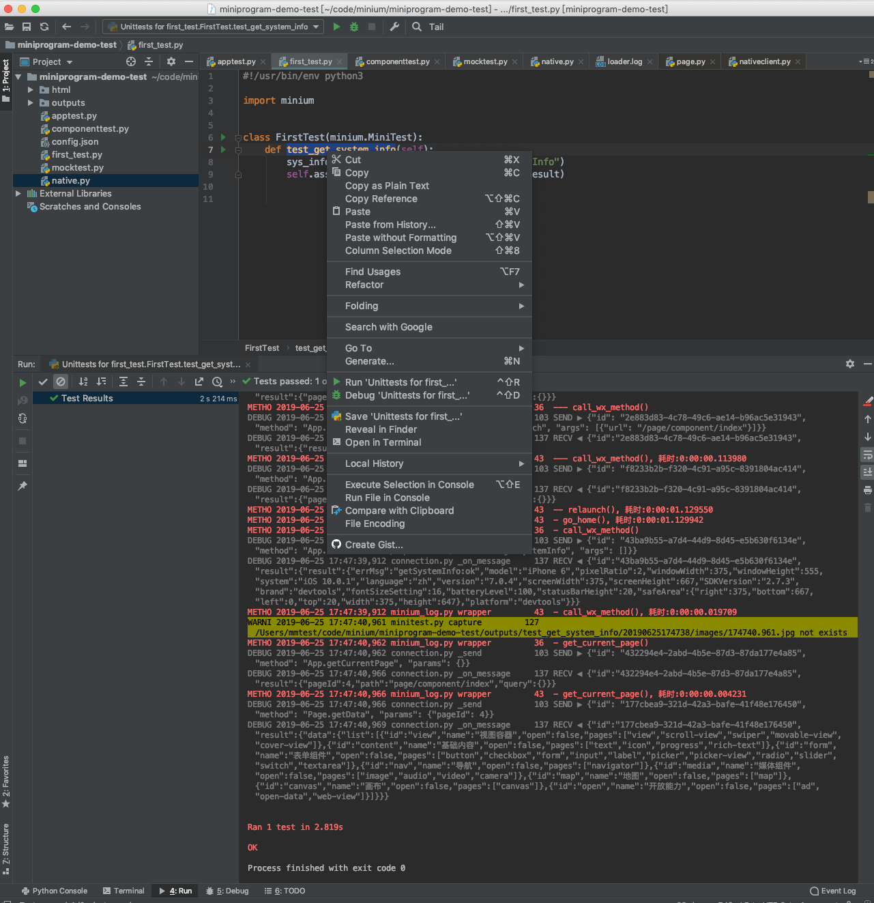

# 快速开始

## 运行环境

- Python 3.x
- 微信公共库版本 >= 2.7.3
- 下载并安装 [稳定版微信开发者工具](https://developers.weixin.qq.com/miniprogram/dev/devtools/stable.html)
- 如果要测Android，请下载微信测试包 [微信测试包](http://dldir1.qq.com/weixin/android/wechat_0x2700069A_1460.apk)

## 必要的知识

本框架与开发者工具有强关联，如果你之前对开发者工具没有基本的了解，可以点击下面的链接了解一些必要的知识：

- Python3 [官网文档](https://docs.python.org/3.0/) [简单教程](http://www.runoob.com/python3/python3-tutorial.html)
- 开发者工具
    - [开发者工具的界面](https://developers.weixin.qq.com/miniprogram/dev/devtools/page.html)
    - [真机调试](https://developers.weixin.qq.com/miniprogram/dev/devtools/remote-debug.html)
    - [命令行调用](https://developers.weixin.qq.com/miniprogram/dev/devtools/cli.html)


## 安装

1. 打开开发者工具的[安全模式](https://developers.weixin.qq.com/miniprogram/dev/devtools/settings.html#%E4%BB%A3%E7%90%86%E8%AE%BE%E7%BD%AE)

    

2. 安装 minium

下载[minium安装包](https://git.weixin.qq.com/minitest/minium-doc/raw/master/minium/Python/dist/minium-0.0.2.zip)，然后执行：

```shell
pip3 install minium-0.0.2.zip
```

亦或者下载解压之后执行：

```shell
python3 setup.py install
```


## 开始

1. 找到开发者工具的[命令行工具](https://developers.weixin.qq.com/miniprogram/dev/devtools/cli.html)， 输入命令打开测试小程序:

!> 这里的`--auto-port`请填写 9420，不是开发者工具安全模式的端口

!> 请确保开发者工具登陆的微信号具备被测小程序的开发者权限

```shell
    path/to/cli --auto /miniprogram/project/path --auto-port 9420

    # path/to/cli 是命令行工具所在位置：
    # macOS: <安装路径>/Contents/MacOS/cli
    # Windows: <安装路径>/cli.bat windows版本在安装之后默认会把cli加入到系统路径，可以先测试cli命令是否可用，如果可用，path/to/cli可以直接用cli替换

    # /miniprogram/project/path 是小程序工程的路径( Windows下面用 \\ 代替 \ )
```

输入之后我们可以看到成功打开对应的小程序，如：




!> 一定要看到命令行有`Open project with automation enabled success`的输出，否则请检查IDE版本，或者检查命令行参数

2. 确认开发者工具调试基础库版本 >= `2.7.3`
   


3. 新建一个`minium_test.py`文件，里面编写以下代码:

```python
#!/usr/bin/env python3
import minium

mini = minium.Minium()
system_info = mini.get_system_info()
print(system_info)
```
然后`python3 minium_test.py`运行:

```shell
$ python3 minium_test.py

{'model': 'iPhone 6', 'pixelRatio': 2, 'windowWidth': 375, 'windowHeight': 555, 'system': 'iOS 10.0.1', 'language': 'zh', 'version': '7.0.4', 'screenWidth': 375, 'screenHeight': 667, 'SDKVersion': '2.7.3', 'brand': 'devtools', 'fontSizeSetting': 16, 'batteryLevel': 100, 'statusBarHeight': 20, 'safeArea': {'right': 375, 'bottom': 667, 'left': 0, 'top': 20, 'width': 375, 'height': 647}, 'platform': 'devtools'}
```

成功执行后说明环境配置成功，如果遇到其他问题，请查看[faq](minium/Python/other/faq.md)

其他SDK提供的接口请参考[API文档](minium/Python/api/readme.md)

!> 如果你想在手机上面运行上面的脚本，可以点击开发者工具的`远程调试`,用手机扫码连接，成功打开远程调试之后，再次运行脚本，脚本就会在手机上面运行了


## 创建第一个测试用例

1. 跟上一步一样先打开开发者工具:
    ```shell
    path/to/cli --auto /miniprogram/project/path --auto-port 9420

    # path/to/cli 是命令行工具所在位置：
    # macOS: <安装路径>/Contents/MacOS/cli
    # Windows: <安装路径>/cli.bat

    # /miniprogram/project/path 是小程序工程的路径
    ```


2. 然后新建一个文件`first_test.py`来编写测试用例:

```python
#!/usr/bin/env python3
import minium

class FirstTest(minium.MiniTest):
    def test_get_system_info(self):
        sys_info = self.app.call_wx_method("getSystemInfo")
        self.assertIn("SDKVersion", sys_info.result.result)

```

关于编写用例的更多内容，请参考[测试框架](minium/Python/framework/framework.md)


## 测试用例执行

### 利用PyCharm CE执行
[PyCharm CE](https://www.jetbrains.com/pycharm/download)是一个免费的IDE，能自动识别python的unittest用例，并且有良好的代码提示功能
比如针对上面的`first_test.py`，鼠标移动到用例的函数直接点击右键:




### 利用命令行运行用例

在安装包之后，比如我们要运行上面的例子，只需要在命令行输入:
```shell
miniruntest -p first_test -g
```
执行结束后，测试数据输出到outputs目录，里面包含一个简易的测试报告，输入` python3 -m http.server 8080 -d outputs`后在浏览器中输入`http://localhost:8080/`可以查看测试报告
其中，更多命令行参数可以通过`miniruntest -h`查看。

?> 我们建议编写用例和调试的时候，可以在IDE上调试和执行。部署测试的时候用命令行，测试输出的结果可以用于存档，如Jenkins的存档或者上传到静态服务器上


### 手机上运行

上面的步骤默认在IDE上运行，如果我们想在手机上运行，比如Android，只需要在用例目录下面新增一个叫`config.json`的配置文件，内容如下：
``` json
 Android：
{
    "platform": "Android"
}
```
然后连接上一台手机，并且保证`adb devices`能够识别手机，有问题请参考[adb文档](https://developer.android.google.cn/studio/command-line/adb#devicestatus)。

然后再执行`miniruntest -p first_test -g`即可。

更多关于手机测试的内容，请参考[测试手机上的小程序](minium/Python/framework/mobile.md)。

!> 注意手机微信上登陆的帐号与开发者工具登陆的帐号需要一致


